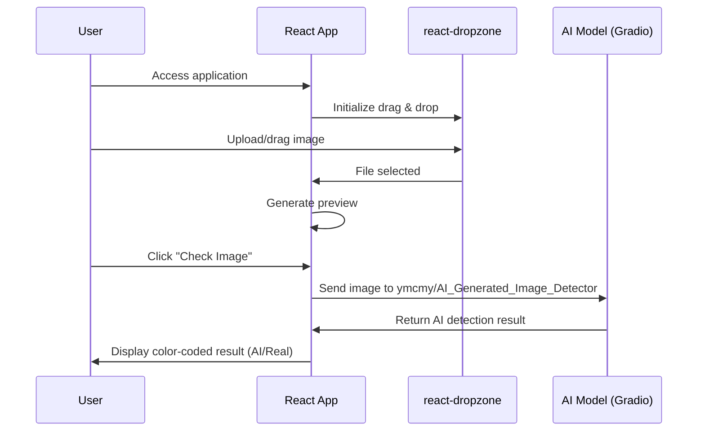

# AI Image Checker

AI Image Checker is a modern web application that allows users to upload images and determine if they are AI-generated or real, using a state-of-the-art Gradio-hosted deep learning model. The app features a drag-and-drop interface, real-time image preview, and clear, color-coded results for an intuitive user experience.

---

## Features

- **Drag & Drop Upload**: Effortlessly upload images via drag-and-drop or file picker.
- **AI Detection**: Utilizes the [ymcmy/AI_Generated_Image_Detector](https://huggingface.co/spaces/ymcmy/AI_Generated_Image_Detector) Gradio model for accurate analysis.
- **Real-Time Preview**: Instantly preview images before submitting for analysis.
- **Visual Results**: Color-coded feedback (green for real, red for AI-generated) for quick interpretation.
- **Responsive Design**: Works seamlessly on desktop and mobile devices.

---

## Technology Stack

- **React** 19.1.1
- **Vite** 7.1.2
- **react-dropzone**: For drag-and-drop file uploads
- **@gradio/client**: To interact with the Gradio AI model
- **axios**: For HTTP requests

---

## Project Structure

```text
frontend/
├── public/
│   └── vite.svg
├── src/
│   ├── assets/
│   │   └── react.svg
│   ├── AIImageChecker.jsx   # Main component for image upload & analysis
│   ├── App.jsx              # App root component
│   ├── App.css              # App styles
│   ├── index.css            # Global styles
│   └── main.jsx             # Entry point
├── index.html
├── package.json
├── vite.config.js
├── eslint.config.js
└── README.md
```

---

## Installation & Setup

### Prerequisites

- [Node.js](https://nodejs.org/) (v18 or higher recommended)
- [npm](https://www.npmjs.com/) (comes with Node.js)

### Steps

1. **Clone the repository:**
   ```sh
   git clone https://github.com/RomeloDev/AI-IMAGE-CHECKER.git
   cd AI-IMAGE-CHECKER/frontend
   ```
2. **Install dependencies:**
   ```sh
   npm install
   ```
3. **Start the development server:**
   ```sh
   npm run dev
   ```
4. **Open in browser:**
   Visit [http://localhost:5173](http://localhost:5173) (or as indicated in the terminal)

---

## Available Scripts

- `npm run dev` — Start the development server
- `npm run build` — Build the app for production
- `npm run preview` — Preview the production build locally
- `npm run lint` — Run ESLint for code quality

---

## How It Works

1. **User uploads or drags an image** into the dropzone area.
2. **App generates a preview** of the image.
3. **User clicks "Check Image"** to analyze.
4. **App sends the image** to the Gradio model using `@gradio/client`.
5. **Model returns a result** indicating if the image is AI-generated or real.
6. **Result is displayed** with color-coded feedback and probability score.

### Sequence Diagram



---

## External Dependencies

- **Gradio AI Model**: [ymcmy/AI_Generated_Image_Detector](https://huggingface.co/spaces/ymcmy/AI_Generated_Image_Detector)
    - Integrated via `@gradio/client` for seamless API calls
- **react-dropzone**: Provides drag-and-drop file upload UI
- **axios**: Handles HTTP requests (if needed)

---

## UI/UX Features

- Clean, minimal interface with clear instructions
- Drag-and-drop and click-to-upload support
- Real-time image preview before analysis
- Color-coded results for instant feedback
- Responsive layout for all device sizes

---

## Deployment

1. **Build the app:**
   ```sh
   npm run build
   ```
2. **Deploy the contents of the `dist/` folder** to your preferred static hosting (e.g., Vercel, Netlify, GitHub Pages)

---

## Future Enhancements

- Support for batch image analysis
- Improved error handling and user feedback
- History of checked images
- Dark mode toggle
- Customizable AI model selection

---

## Contributing

Contributions are welcome! To contribute:

1. Fork the repository
2. Create a new branch (`git checkout -b feature/your-feature`)
3. Commit your changes
4. Push to your fork and open a Pull Request

---

## License

This project is licensed under the [MIT License](../LICENSE).
